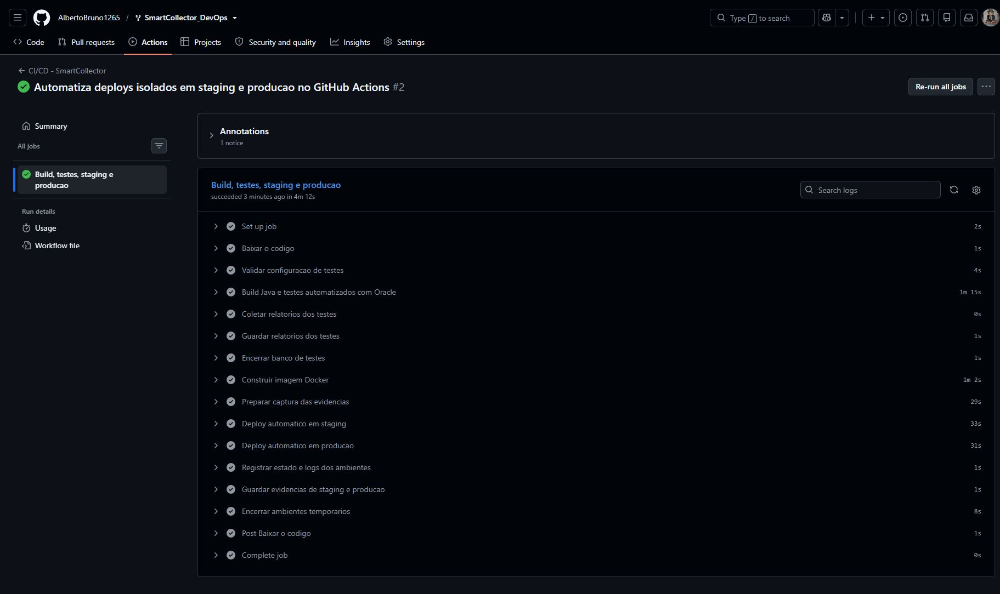
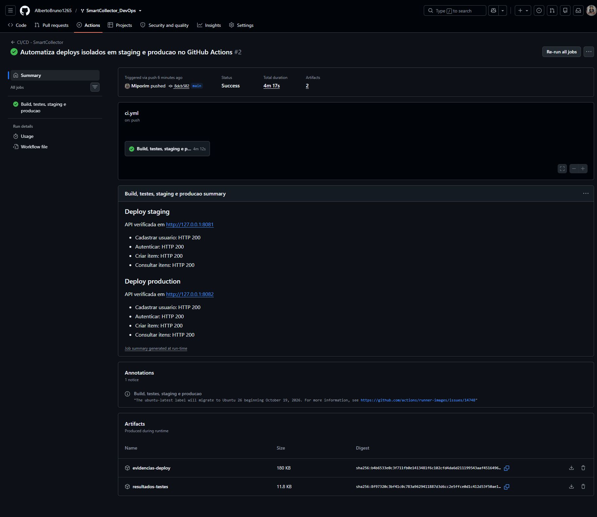

# SmartCollector — Cidades ESG Inteligentes

API Java Spring para gerenciar usuarios, itens e coletas. O desafio DevOps usa Docker Compose e GitHub Actions para automatizar build, testes e deploy em staging e producao.

## Como executar localmente com Docker

Requisito: Docker Desktop iniciado, com containers Linux. O Oracle e incluido no Compose; nao depende do banco da faculdade.

Na raiz do projeto, copie o modelo e preencha as senhas e o JWT_SECRET:

```powershell
Copy-Item .env.example .env
docker compose up -d --build
docker compose ps
```

A API local usa http://localhost:8080. Como ha autenticacao JWT, abrir a raiz no navegador nao demonstra uma pagina web. Use os endpoints abaixo via Postman ou cliente HTTP:

- POST /auth/registro: nome, email, senha e funcao USER.
- POST /auth/login: email e senha; retorna token.
- GET /itens: enviar Authorization: Bearer TOKEN.
- POST /itens: enviar nome e volume, com o mesmo token.

O arquivo .env nao e enviado ao Git e nao entra no contexto de build. Editar uma senha no .env nao troca as credenciais de um Oracle ja inicializado.

### Executar staging e producao no computador do avaliador

Os dois ambientes usam a mesma imagem e projetos Compose separados. Nenhum runner no computador do autor e necessario. O avaliador pode executar os comandos na propria maquina.

```powershell
docker build -t smartcollector:local .
.\scripts\deploy.ps1 -Environment staging
.\scripts\deploy.ps1 -Environment production
```

| Ambiente | API | Projeto Compose |
| --- | --- | --- |
| Staging | http://localhost:8081 | smartcollector-staging |
| Producao | http://localhost:8082 | smartcollector-production |

Cada projeto tem seu proprio Oracle, volume oracle_data e rede backend. O banco nao publica portas; apenas a API e publicada no localhost do computador.

Para verificar automaticamente cadastro, login, criacao e consulta de um item (Python 3):

```powershell
python scripts/check-deploy.py staging http://localhost:8081
python scripts/check-deploy.py production http://localhost:8082
```

A verificacao cria dados de demonstracao. Os resultados JSON e HTML ficam em evidencias/. Python e usado para a verificacao; nao e necessario para iniciar os containers ou consultar a API com Postman.

Para parar sem apagar os dados:

```powershell
$env:APP_IMAGE = 'smartcollector:local'
$env:APP_PORT = '8081'
docker compose -p smartcollector-staging -f compose.deploy.yml stop
$env:APP_PORT = '8082'
docker compose -p smartcollector-production -f compose.deploy.yml stop
```

## Pipeline CI/CD

Arquivo: .github/workflows/ci.yml. Executa em maquinas temporarias Ubuntu do GitHub, sem usar o computador do autor.

1. Baixa o codigo do commit.
2. Inicia Oracle isolado e executa Maven clean verify, incluindo o teste existente.
3. Guarda os relatorios Surefire.
4. Encerra o banco de testes e constroi a imagem Docker, identificada pelo commit.
5. Em main, realiza deploy em staging e verifica a API.
6. Se staging passar, realiza deploy em producao com a mesma imagem e verifica a API.
7. Guarda prints, respostas HTTP, estado dos containers e logs.
8. Encerra os dois ambientes temporarios.

Push em main e execucao manual em main fazem o fluxo completo. Pull requests executam build e testes, sem deploy. Uma falha interrompe as etapas seguintes; coleta de evidencias e limpeza tentam executar mesmo com falhas.

Os ambientes do Actions funcionam durante a demonstracao e sao encerrados ao final. Nao ha endpoint publico permanente. As credenciais no workflow sao exclusivas dos bancos temporarios da demonstracao e nao correspondem a um servidor externo.

## Testes automatizados

```powershell
.\scripts\test.ps1
```

O script usa compose.test.yml e o projeto smartcollector-tests. Um Oracle separado, sem portas publicadas, permite executar o teste contextLoads(). O teste verifica a inicializacao do contexto Spring e nao cobre todos os fluxos da API.

Somente pom.xml e src sao montados para leitura; o build ocorre numa copia interna. O .env nao e montado no container Maven. Os relatorios ficam em test-results/surefire-reports. Os containers sao parados ao final; os volumes de testes e cache Maven ficam preservados localmente.

## Containerizacao

O Dockerfile usa duas etapas:

```dockerfile
FROM maven:3.9.9-eclipse-temurin-21 AS build
WORKDIR /app
COPY pom.xml .
RUN mvn dependency:go-offline -B
COPY src ./src
RUN mvn clean package -DskipTests

FROM eclipse-temurin:21-jre-alpine
WORKDIR /app
COPY --from=build /app/target/*.jar app.jar
EXPOSE 8080
ENTRYPOINT ["java", "-jar", "app.jar"]
```

Maven e JDK compilam na primeira etapa. A segunda recebe o JAR e o JRE, sem as ferramentas de build. Copiar pom.xml antes de src permite reaproveitar a camada de dependencias. Os testes sao executados antes em etapa propria; por isso o empacotamento da imagem usa -DskipTests.

Compose orquestra a API e o Oracle, usa volume para os dados, variaveis para configuracao e rede para comunicacao. O healthcheck do Oracle condiciona o inicio da API. A aplicacao usa Hibernate ddl-auto=update; Flyway esta desativado na configuracao original.

## Prints do funcionamento

Na aba Actions, abra a execucao e os artefatos:

- resultados-testes: relatorios Surefire e logs.
- evidencias-deploy: staging.png, production.png, respostas JSON, paginas HTML e logs.

Os PNGs mostram relatorios de chamadas reais a API: cadastro, login, criacao e consulta de itens. Sao evidencias HTTP da API, nao uma interface web da aplicacao. Senhas e tokens nao sao registrados nesses relatorios.

Execucao comprovada em 07/10/2026: [build, testes e dois deploys aprovados](https://github.com/AlbertoBruno1265/SmartCollector_DevOps/actions/runs/37665521088), commit `8dcb582`, duracao de 4min17s. Cadastro, login, criacao e consulta de itens retornaram HTTP 200 nos dois ambientes.





Esses prints ficam no repositorio para preservar a evidencia apos a expiracao dos artefatos do Actions (14 dias). Os relatorios detalhados e PNGs de cada ambiente estao no artefato `evidencias-deploy` dessa execucao.

## Tecnologias utilizadas

Java 21, Spring Boot 4.0.6, Maven, Spring Security/JWT, JPA/Hibernate, Oracle Free, Docker, Docker Compose, GitHub Actions e Python. Playwright captura os prints das evidencias no runner do GitHub.

## Checklist de entrega

- [ ] ZIP final com codigo e configuracoes.
- [x] Dockerfile construido e executado.
- [x] Compose com volume, variaveis e rede.
- [x] Build e teste existente executados no GitHub Actions.
- [x] Deploy em staging e producao executado e verificado no GitHub Actions.
- [x] README com instrucoes e acesso as evidencias do pipeline.
- [ ] PDF ou PPT com integrantes e evidencias.
